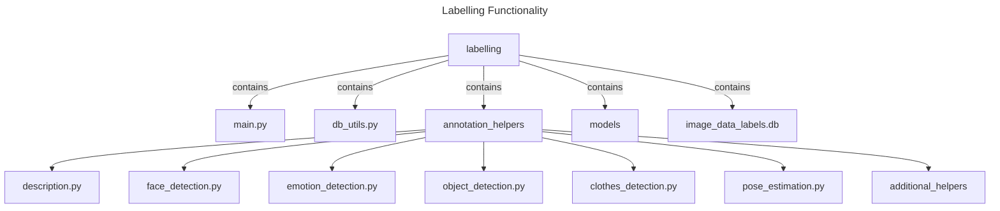

# Project: Labelling for StyleGAN3 Preparation

## Overview
This project, named "Labelling," is designed to assist in the preparation of data for StyleGAN3 by generating a diverse set of annotations for images. The project is structured to process images and videos locally, using a variety of deep learning models for different types of annotations. All annotations are stored efficiently in an SQLite database, with the capability to handle batch commits.

## Project Structure

## Setup and Installation
### Dependencies
- Python 3.8+
- Libraries: torch, transformers, opencv-python, sqlite3, PIL, etc.
- Model-specific dependencies as per individual helper module requirements.

### Installation
1. Clone the repository and navigate to the `labelling` directory.
2. Install the required Python libraries using `pip install -r requirements.txt`.
3. Download and place the necessary model files in the `models/` directory.

## Usage
### Main Script (`main.py`):
- Coordinates the processing of images and videos.
- Calls helper functions from `annotation_helpers/` to perform specific annotations.
- Stores annotation results in the SQLite database using `db_utils.py`.

### Database Utilities (`db_utils.py`):
- Handles all database-related operations.
- Includes functions to create tables, insert data, and manage batch commits.

### Annotation Helpers:
- Each helper module in `annotation_helpers/` is responsible for a specific type of annotation.
- Helper modules can be individually activated in `main.py` as needed.

## Running the Script
1. Run `python main.py` to start processing.
2. Input the path to the image/video folder when prompted.
3. The script will process each file, generate annotations, and store them in the database.

## Annotation Modules
### Description (`description.py`):
- Uses BLIP model for generating detailed image descriptions.
- Source: [BLIP GitHub Repository](https://github.com/salesforce/BLIP)

### Face Detection (`face_detection.py`):
- Implements face detection using libraries like OpenFace or InsightFace.
- Source: [OpenFace GitHub](https://github.com/TadasBaltrusaitis/OpenFace), [InsightFace GitHub](https://github.com/deepinsight/insightface)

### Emotion Detection (`emotion_detection.py`):
- Uses DeepFace or FER for analyzing facial emotions.
- Source: [DeepFace GitHub](https://github.com/serengil/deepface), [FER GitHub](https://github.com/justinshenk/fer)

### Object Detection (`object_detection.py`):
- Incorporates models like YOLOv8 for object detection and labeling.
- Source: [Ultralytics GitHub](https://github.com/ultralytics/ultralytics)

### Clothes Detection (`clothes_detection.py`):
- Utilizes Mask R-CNN with DeepFashion dataset for clothing detection.
- Source: [DeepFashion GitHub](https://github.com/yumingj/DeepFashion-MultiModal)

### Pose Estimation (`pose_estimation.py`):
- Implements OpenPose or TensorFlow Lite's MoveNet for posture and pose estimation.
- Source: [OpenPose GitHub](https://github.com/CMU-Perceptual-Computing-Lab/openpose), [MoveNet TensorFlow Hub](https://github.com/haotian-liu/LLaVA)

**Note:**
- Ensure compliance with legal and ethical standards, especially regarding facial recognition and emotion detection technologies.
- Database operations in `db_utils.py` are designed for efficiency and support batch processing.
- Batch size can be configured in `main.py`.
- Each batch of annotations is committed to the database once processed.
- The [DINOv2](https://github.com/facebookresearch/dinov2) repository is included as a reference for future enhancements or additional functionality.
